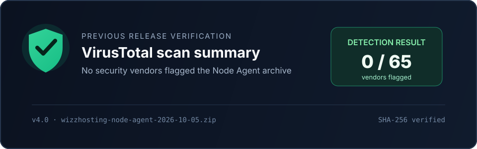

# WizzHosting

[](https://bolt.new/~/sb1-4zrtpk3l)

WizzHosting is a self-hosted Minecraft server control panel. It gives you a clean web dashboard for creating, starting, stopping, monitoring, and managing Minecraft servers that run on your own computer.

The project combines a hosted web interface with a lightweight Node Agent. The web app handles configuration and server management, while the Node Agent runs the actual Minecraft processes on a machine you control.

## Highlights

- Create and manage multiple Minecraft servers from one dashboard
- Support for Java and Bedrock server workflows
- Choose server software, Minecraft version, memory, CPU, storage, and port settings
- Live server status, resource usage, uptime, player counts, and console output
- File manager for server directories and configuration files
- Backups, activity history, schedules, networking, plugins, players, and world management
- Local Node Agent with Windows, macOS, and Linux launchers
- Supabase-backed authentication, database storage, and server functions
- Responsive interface for desktop and mobile screens
- Downloadable Node Agent package with an independently verifiable scan result

## How it works

```text
Web dashboard  ──────►  Supabase
      │                    │
      │                    └── Authentication, data, and server functions
      │
      └──────────────►  Node Agent on your computer
                              │
                              └── Minecraft server processes and files
```

The Node Agent is the bridge between the dashboard and your local machine. It keeps the Minecraft server files and processes on your computer while reporting status and receiving approved management actions from the dashboard.

## Requirements

- Node.js 18 or newer for the web project
- Java 17 or newer for Minecraft 1.17 and later
- Java 8 for older Minecraft versions where required
- A computer that can run the Minecraft server software you select
- A Supabase project for authentication, application data, and server functions

## Getting started

### 1. Install the web project

```bash
npm install
npm run dev
```

The production build can be created with:

```bash
npm run build
```

### 2. Configure the web app

Copy `.env.example` to `.env` and provide the values for your own Supabase project. Never commit `.env` or place private service credentials in the browser application.

### 3. Install Java

Install the Java version required by the Minecraft version you plan to run. The Node Agent checks the available Java installation when it starts.

### 4. Run the Node Agent

Download the latest Node Agent archive from the dashboard, extract it into its own folder, and run the launcher for your operating system:

- Windows: `start-windows.bat`
- macOS or Linux: `start-mac-linux.sh`

Keep the Node Agent running while you manage or play on your servers.

### 5. Create a server

1. Sign in to CubeForge.
2. Open the dashboard and select **Create Server**.
3. Choose the Minecraft edition, version, software, and resource limits.
4. Accept the Minecraft EULA.
5. Create the server and open its server panel.
6. Start the server from the panel.
7. Connect using the address shown in the dashboard.

For the full setup and networking guide, see [SETUP.md](./SETUP.md).

## Supported server software

| Software | Download workflow | Notes |
| --- | --- | --- |
| Vanilla | Automatic | Uses official Mojang server downloads |
| Paper | Automatic | Uses the PaperMC API |
| Purpur | Automatic | Uses the Purpur API |
| Fabric | Automatic | Uses the Fabric installer |
| Forge | Manual | Requires the Forge installer and setup files |
| NeoForge | Manual | Requires the NeoForge installer and setup files |
| Bedrock | Manual | Requires the official Bedrock server package |
| Spigot | Manual | Requires a BuildTools build |

## Node Agent verification

The current Node Agent archive was checked with VirusTotal. The supplied report showed **0 of 65 security vendors flagged the file**.



This visual is a summary of the scan result, not a replacement for the provider's report. View the full result on [VirusTotal](https://www.virustotal.com/gui/file/f1005ad3c51559da1c4fa7b894e6863d09660c608a8f8cc3f8166d21b96d8457/details).

| Detail | Value |
| --- | --- |
| Archive | `wizzhosting-node-agent-2026-10-05.zip` |
| Detection result | `0 / 65` |
| SHA-256 | `f1005ad3c51559da1c4fa7b894e6863d09660c608a8f8cc3f8166d21b96d8457` |

## Project structure

```text
.
├── public/                 Static assets and downloadable Node Agent archives
├── src/                    React application and pages
│   ├── components/         Shared layout, UI, and server management views
│   ├── lib/                Authentication, Supabase, and utility helpers
│   └── pages/              Landing, dashboard, auth, and server views
├── node-agent/             Local Node Agent and operating-system launchers
├── supabase/
│   ├── functions/          Server API and file-management functions
│   └── migrations/         Database and access-control changes
├── SETUP.md                Detailed installation and networking guide
└── package.json            Web application scripts and dependencies
```

## Networking

Local play works with the address shown by the Node Agent. To let friends connect from another network, configure port forwarding on your router or use a supported tunnel service. The required port depends on the server configuration, with `25565` being the common default for Java Edition.

Opening a port to the internet has security and privacy implications. Use a firewall, keep Java and Minecraft server software updated, and only expose the ports you need.

## Security and configuration

- Keep `.env` and `node-agent/.env` out of source control.
- Use `.env.example` files for placeholders only.
- Never put Supabase service-role credentials in frontend code or public repositories.
- Review firewall and port-forwarding rules before making a server reachable from the internet.
- Treat server console output, player data, backups, and world files as private application data.

## Troubleshooting

### The dashboard says no compute node is connected

Make sure the Node Agent is running and that it was configured for the same CubeForge project. Keep its launcher window open while managing servers.

### A server stays in Starting

Check the Node Agent output, confirm Java is installed and available, and verify that the configured port is not already in use.

### Friends cannot connect

Confirm that the server is online, the address and port are correct, and the router or tunnel allows traffic to the computer running the server.

### A server download fails

Check the internet connection and confirm that the selected Minecraft version and server software are available. Forge, NeoForge, Bedrock, and Spigot may require manual setup.

## License

No license has been declared yet. Until a license is added, all rights are reserved by the project owner.

## Acknowledgements

WizzHosting uses Supabase for authentication and hosted application services, React and Vite for the web application, Tailwind CSS for styling, and Lucide for interface icons.
